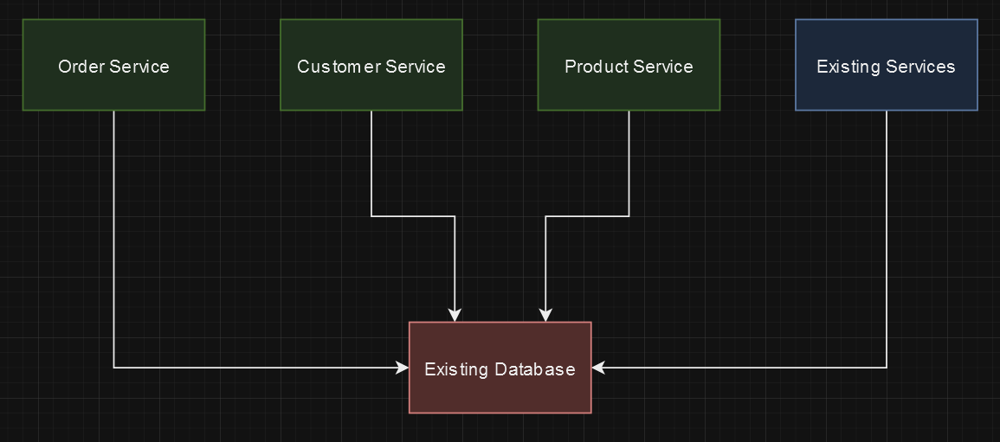

# Part 2

## Task 1:

Each microservice will bring the capabilities of horizontal scaling and high availability that comes with all microservices to each service and make them able to be resilient independent of other services.

The logic should be moved out of the database and into microservices for a number of reasons, the biggest reason is that databases are not meant to scale as quickly as web/microservices, nor can they be scaled in the same way as their inherint transactional safety with M/S and different read/write endpoint as well as latency in their availability of the written or to be written data. As best practice, the database should be relied upon for data integrity and source of truth only, and leave the logic and data manipulation for services.

The overall architecture will be infinitely more scalable and the cost savings will be huge, especially if you consider future growth of traffic as scaling a database would be exponentially more costly to achieve the same results as microservices.

## Task 2:

Run the web api using dotnet 8 LTS using Visual Studio 2022 with a local MS SQL server running. (You may have to tweak the connection string in appsettings.)

Some things to consider:

- All endpoints can be tested using curl, Postman, or by using the Swagger UI that should pop-up if the service loads properly.
- The database should seed automatically with some dummy data. I mostly used the schema from part one, but did take some liberties there.
- I didn't setup tests or DI/Interfaces because it was already a bunch of work to get this far and I would be happy to talk about testability if need be.
- I added comments to all the files and tried to be super verbose with everything.
- I realized only after I was mostly finished that I may have done more than you were asking so the diagram didn't make much sense, so I apologize if that is confusing.
- The request/response payloads are visible on the swagger page when you run the service.
